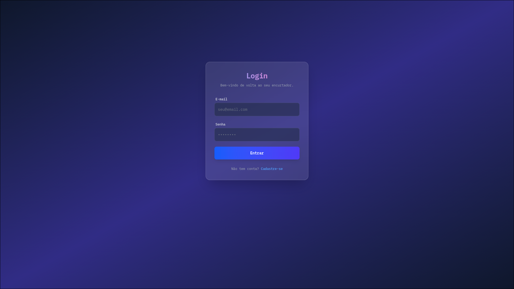
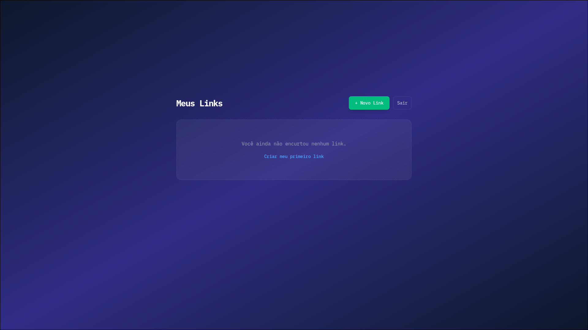

## 🧭 **Encurtador de URL em Ruby on Rails**

### 📌 **Descrição do Projeto**

Este projeto é um **Encurtador de URLs** desenvolvido em **Ruby on Rails** com **PostgreSQL** e **TailwindCSS**, sem o uso do Devise.
O sistema permite que **usuários autenticados** criem e gerenciem seus próprios links encurtados de forma segura e simples.

### Página de Login

### Página de links

---

### 🎯 **Objetivos da Atividade**

Atender aos seguintes **requisitos de negócio**:

1. Cada link encurtado deve possuir um **código único** (`short_code`).
2. Todo link pertence a **um usuário específico**.
3. Ao acessar um link encurtado (ex: `/abc123`), o sistema deve **redirecionar** para o link original.
4. Somente **usuários autenticados** podem criar e gerenciar links.
5. Usuários **não podem visualizar nem excluir links de outros usuários**.

---

### ⚙️ **Tecnologias Utilizadas**

* **Ruby 3.4+**
* **Rails 8**
* **PostgreSQL**
* **TailwindCSS** (para o estilo visual)
* **Importmap** (para gerenciar JavaScript nativo)
* **bcrypt** (para autenticação de senha)

---

### 🧩 **Funcionalidades Principais**

| Função            | Descrição                                       |
| ----------------- | ----------------------------------------------- |
| 🧍 Cadastro/Login | Usuário cria uma conta e faz login manualmente  |
| 🔗 Criar Link     | Gera um link encurtado exclusivo para cada URL  |
| 📜 Listar Links   | Mostra todos os links criados pelo usuário      |
| 🚀 Redirecionar   | Ao acessar `/short_code`, leva ao link original |
| 🗑️ Excluir Link  | Remove o link do banco de dados                 |
| 🚪 Logout         | Finaliza a sessão do usuário                    |

---

### 🗄️ **Modelos Principais**

#### **User**

| Campo             | Tipo   | Descrição                      |
| ----------------- | ------ | ------------------------------ |
| `name`            | string | Nome do usuário                |
| `email`           | string | Email único (login)            |
| `password_digest` | string | Senha criptografada com bcrypt |

#### **Link**

| Campo          | Tipo    | Descrição                           |
| -------------- | ------- | ----------------------------------- |
| `original_url` | string  | URL original informada pelo usuário |
| `short_code`   | string  | Código curto gerado automaticamente |
| `user_id`      | integer | ID do dono do link                  |

---

### 💻 **Como Executar o Projeto**

#### 1️⃣ **Clonar o repositório**

```bash
git clone https://github.com/seu-usuario/url_shortener.git
cd url_shortener
```

#### 2️⃣ **Instalar dependências**

```bash
bundle install
```

#### 3️⃣ **Criar o banco de dados**

Certifique-se de ter o **PostgreSQL** rodando, então execute:

```bash
rails db:create db:migrate
```

#### 4️⃣ **Rodar o servidor**

```bash
foreman start -f procfile.dev
```

Acesse em:
👉 **[http://localhost:5000](http://localhost:5000)**

---

### 🧱 **Estrutura de Diretórios**

```
app/
 ├── controllers/
 │    ├── links_controller.rb
 │    ├── users_controller.rb
 │    └── sessions_controller.rb
 │
 ├── models/
 │    ├── link.rb
 │    └── user.rb
 │
 ├── views/
 │    ├── links/
 │    ├── users/
 │    └── sessions/
 │
 └── layouts/
      └── application.html.erb
```

---

### 🧠 **Fluxo de Uso**

1. O usuário acessa `/signup` e cria uma conta.
2. Faz login em `/login`.
3. É redirecionado para `/links`, onde pode:

   * Criar um novo link (`/links/new`)
   * Visualizar seus links
   * Excluir links criados
4. Ao acessar um link curto (ex: `/xyz123`), o sistema redireciona para a URL original.
5. Pode sair do sistema clicando em **“Sair”**.

---

### 🎨 **Interface**

A interface utiliza **TailwindCSS**, garantindo um layout limpo e responsivo:

* Cores modernas
* Botões arredondados e sombreados
* Cards para exibir os links
* Alertas de sucesso/erro flutuantes no topo da tela

---

### 🔐 **Segurança Implementada**

* Apenas usuários autenticados acessam `/links`
* Cada usuário só pode ver ou excluir os **próprios links**
* `before_action` garante autenticação e autorização no controller
* Senhas criptografadas com **bcrypt**

---

### 📚 **Rotas Principais**

| Método | Rota           | Controller#Ação  | Descrição                     |
| ------ | -------------- | ---------------- | ----------------------------- |
| GET    | `/signup`      | users#new        | Formulário de cadastro        |
| POST   | `/users`       | users#create     | Cria novo usuário             |
| GET    | `/login`       | sessions#new     | Formulário de login           |
| POST   | `/login`       | sessions#create  | Autentica usuário             |
| DELETE | `/logout`      | sessions#destroy | Logout                        |
| GET    | `/links`       | links#index      | Lista links do usuário        |
| GET    | `/links/new`   | links#new        | Novo link                     |
| POST   | `/links`       | links#create     | Cria link                     |
| GET    | `/links/:id`   | links#show       | Mostra link                   |
| DELETE | `/links/:id`   | links#destroy    | Exclui link                   |
| GET    | `/:short_code` | links#redirect   | Redireciona para URL original |

---
## 💻 Dicas para VS Code

Para garantir que o **Ruby LSP** (Intellisense/Autocomplete) funcione corretamente e não apresente erros de versão:

1. O projeto possui um arquivo `.ruby-version` definindo a versão exata do Ruby.
2. **Sempre abra o VS Code pelo terminal** para carregar corretamente o ambiente:
```bash
cd analisador_rails
code .

```

3. Utilize a extensão oficial **Ruby LSP** (Shopify).

## 🎥 Demonstração em Vídeo

Veja como o programa funciona na prática:

[](https://youtu.be/M_8bwcdTDoE)

> 🔗 **Link direto para o vídeo:** [youtube.com/watch?v=M_8bwcdTDoE](https://youtu.be/M_8bwcdTDoE)


### 👨‍💻 **Autor**

**Jean Carlos**

Projeto desenvolvido como parte da disciplina de **Programação Avançada com Ruby on Rails**.

---

### 📜 Licença
Este projeto está licenciado sob os termos da [MIT License](./LICENSE).

---
